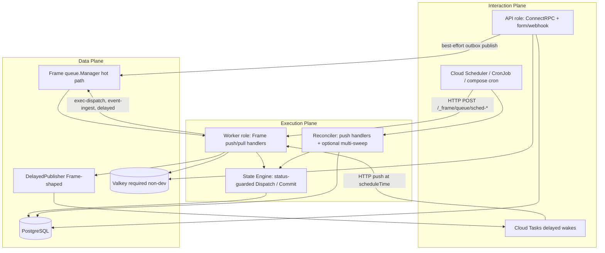
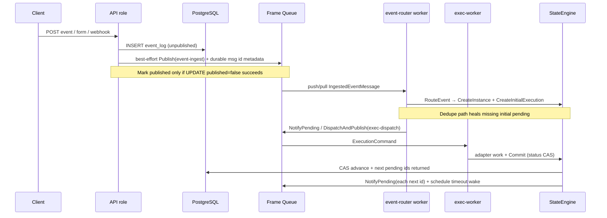

# Design: Horizontally Scalable, Cloud Run–Eligible Re-Architecture of service-trustage

| Field | Value |
|-------|--------|
| **Document** | Cloud Run / horizontal-scale re-architecture |
| **Author** | TBD |
| **Date** | 2026-07-25 |
| **Status** | Implemented (Rev 2.4 — greenfield; no legacy tickers) |
| **Repo** | `/home/j/code/antinvestor/service-trustage` |
| **Related** | `ARCHITECTURE.md`, ADR-001/004/013/016, `docs/runbook-scheduler.md`, Frame v2.0.12 `docs/queue.md` |

---

## Overview

`apps/default` today is a single always-on control plane: ConnectRPC + form/webhook ingress + **nine in-process ticker schedulers** + **two NATS JetStream pull subscribers**, all co-located in every pod. Some scheduling paths are multi-instance-safe (timer/signal/outbox **claim leases**, instance CAS on `workflow_instances.revision`, execution tokens), but **dispatch, retry, and execution-timeout are not dual-path-safe today** (`UpdateStatus` / `MarkTimedOutAndCreateRetry` lack expected-status predicates; `FindPending` locks are statement-scoped). Operationally the design taxes every replica with continuous 1s/5s polling, requires min-instances > 0 for progress, and is a poor fit for Cloud Run scale-to-zero / push-driven workloads.

This design re-architects trustage into **role-separated processes of one binary**, moves messaging through Frame `queue.Manager` with **config-driven URL schemes** (hot path strictly via Manager; delayed Cloud Tasks via a Frame-shaped helper until upstream supports per-message `scheduleTime`), replaces ticker loops with **event-driven work + delayed tasks + external reconcile**, and hardens multi-instance cache and migrations. Core engine invariants (PostgreSQL as source of truth, CAS transitions after hardening, execution tokens, contract validation, multi-tenant isolation) are preserved.

**Rev 2 critical deltas:** dual-path claim hardening is a hard prerequisite before dual notify / ticker removal; full per-role publisher matrix; split timer vs cron SLOs with first-class non-GCP reconciler multi-sweep; outbox at-least-once + heal-on-dedupe; push duration and Cloud Run constraints.

**Rev 2.1:** execution-timeout path full expected-status CAS (same dual-path gate as Dispatch/retry); legacy-ticker allowlist + mutual exclusion with multi-sweep; PR cross-reference cleanup.

**Rev 2.2 (product lock-in):** primary target **Cloud Run + Pub/Sub + Cloud Tasks**; long-term GCP messaging **Pub/Sub + Tasks only** (NATS for local/non-GCP); cron lag SLO **60s**; **per-step execution timeouts** in this re-arch; **no cancel** of delayed Tasks (idempotent no-op); Cloud Run request/step budget **300s** (matches `DEFAULT_EXECUTION_TIMEOUT_SECONDS`).

---

## Background & Motivation

### Current state (verified)

`apps/default/cmd/main.go` starts:

| Component | Mechanism | Notes |
|-----------|-----------|--------|
| ConnectRPC (workflow/event/runtime/signal) | HTTP | Public API |
| Form + webhook ingress | HTTP | Writes `event_log` |
| Dispatch, retry, timer, signal, scope, timeout, outbox | `time.Ticker` → `RunOnce` / `RunUntilDrained` | Intervals: most **5s**, retry **10s**, timeout **30s** (not uniform) |
| Cleanup | Ticker every **6h** | Retention purge |
| Cron | Ticker every **1s** | `ClaimAndFireBatch` |
| exec-worker, event-router | Frame pull subscribers (NATS JS defaults) | `queue.SubscribeWorker` |
| Publishers | `frame.WithRegisterPublisher` | exec-dispatch, event-ingest |

Workers already implement Frame’s `queue.SubscribeWorker` (`execution_worker.go`, `event_router_worker.go`). Schedulers isolate business logic in `RunOnce` / `RunUntilDrained` — but **claim strength differs by scheduler** (see Dual-path claim hardening).

Config defaults (`apps/default/config/config.go`):

- Cron **1s**, most sweeps **5s**, retry **10s**, timeout **30s**, cleanup **6h**
- Default execution timeout **300s**
- NATS JetStream URLs baked in with durable consumers
- DB pool **50** + dedicated scheduler pool **10** per instance (`pool "scheduler"` isolates cron fire-path from HTTP)
- Valkey with **silent in-memory fallback** (`apps/default/service/cache/cache.go`) — unsafe under multi-instance rate limits / shared cache

Ops docs assume K8s Deployment + HPA 1–12 pods (`docs/runbook-scheduler.md`).

### Pain points

1. **Always-on CPU tax**: every pod runs nine tickers even with zero due work; cron alone is 1 Hz × N pods against PostgreSQL.
2. **Latency floor**: pending executions wait up to `DispatchIntervalSeconds` (default 5s) after commit; retries/timers similar.
3. **Cloud Run ineligible for “progress”**: scale-to-zero freezes workflows; pull consumers and tickers need long-lived processes.
4. **Transport coupling in ops defaults**: NATS URLs are defaults, not abstractions — GCP Pub/Sub push + Cloud Tasks require a disciplined config/URL redesign.
5. **Silent cache fallback**: multi-pod in-memory caches break rate-limit fairness and schema cache consistency.
6. **Migrate-on-start race**: every pod runs `repository.Migrate` (GORM AutoMigrate + indexes) on boot (`main.go` lines 115–117), racing DDL across replicas.
7. **Dispatch/retry/timeout not CAS-guarded**: concurrent dual-path (future wake + reconcile) would double-dispatch / double-retry / double-timeout-materialize without hardening.

### What must stay

- Contract-driven state engine (Dispatch / Commit, schemas, mappings)
- DSL, connectors, multi-tenant isolation (`tenant_id` everywhere)
- Execution tokens (single-use), outbox pattern for events
- PostgreSQL as sole authority for workflow state
- Transport carries work units / `execution_id` only — never “decides” state

---

## Goals & Non-Goals

### Goals

1. **No production multi-ticker engine in the API process** (and no nine always-on loops in every pod).
2. **Event-driven primary path** for known due times + **external reconcile** safety nets.
3. **Messaging via Frame queue abstractions** for all hot-path publish/subscribe; delayed scheduling via Frame schemes when possible, with a **documented Frame-shaped DelayedPublisher exception** until Frame supports per-message `scheduleTime` (see Goals nuance below).
4. **Process/role separation** for independent scale: API vs workers vs reconciler, with a complete **publisher + subscriber matrix per role**.
5. **Horizontally scalable and dual-path safe**: status-guarded Dispatch, atomic retry materialize, status-guarded execution-timeout (retry + terminal), claim leases where already present, idempotent handlers.
6. **Efficient**: eliminate continuous 1s/5s polling tax on API; delayed wake when transport supports it; reconcile cadence sized to **SLO class** (timer ≠ cron).
7. **Cache fail-closed** for shared state in non-dev (manifests; default config remains fail-open for local).
8. **Migrations out-of-band** (Job / one-shot); serving pods do not race DDL.
9. **Cloud Run–eligible** deployment path: push subscribers + Cloud Tasks delayed + Cloud Scheduler reconcile, with request-duration constraints documented.
10. **Preserve** engine correctness invariants; harden claim paths that dual-path exposes.

### Goals nuance — messaging purity

| Traffic | Mechanism |
|---------|-----------|
| Hot path (event-ingest, exec-dispatch, pull/push workers) | **Only** `queue.Manager` + config URLs |
| Delayed wakes (retry/timer/timeout/signal) | `DelayedPublisher` implementing CreateTask with per-message `scheduleTime`, **reusing Frame’s URL parse / ADC / request JSON shape** (`queue/publish_cloudtasks.go`, `scheme.go`). Not a second ad-hoc GCP client with divergent auth. Upstream track: Frame metadata `schedule_time` / `schedule_delay` on Publish. |
| Forbidden | Short-lived `AddPublisher` per message under load; raw `nats.Connect()` |

### Non-Goals

- Rewriting the state engine, DSL, or connector model.
- Splitting into one microservice per scheduler.
- Dropping PostgreSQL as source of truth or moving orchestration state into the bus.
- **Sub-minute cron precision** — product locked **60s max lag**; 5-field cron floor is already ~30s (`dsl/schedule.go`).
- Full rewrite of formstore/queue apps (light alignment only).
- Replacing Frame with custom NATS/Pub/Sub clients for hot path.

### Latency / precision SLOs (split — do not conflate)

| Work class | Today | With Cloud Tasks / delayed transport | Without delayed transport (GKE+NATS, local Noop) |
|------------|-------|--------------------------------------|--------------------------------------------------|
| **Workflow timers / delays** | Poll default **5s** (`TimerIntervalSeconds`); ARCHITECTURE aspirational “~1s” | Near-due ± network (target: fire within ~1–2s of `fires_at`) | **Reconciler multi-sweep ≤5–10s** is **required** in production (not 1–2 min) |
| **Retries / signal timeouts / execution timeouts** | 5–30s sweeps; global default only today | Delayed wake at **per-step** (or workflow / default) deadline; Cloud Run step hard cap **300s** | Same reconciler multi-sweep ≤5–10s for due work |
| **Cron (`schedule.fired`)** | 1s ticker (tighter than original 30s floor) | **Locked: 60s max lag** — Cloud Scheduler every 60s (or CronJob `*/1`) | Same; not tied to timer reconciler |
| **Outbox / dispatch lag (primary path)** | Up to poll interval | Notify path: ms–tens of ms when publish works | Notify path still works (immediate Publish); reconcile is backup |

**Rule:** Do **not** disable legacy tickers (**PR8**) on a non-Cloud-Tasks environment unless either (a) delayed transport is live, or (b) a reconciler multi-sweep runner (role `reconciler` / `all` / `worker` with reconcile-in-worker, or push-invoked equivalent at ≤10s) is live for timer/retry/timeout/signal/dispatch/outbox. Canonical gate: dual-path hardening (**PR2**, including execution-timeout CAS) blocks dual notify at scale (**PR5**) and ticker disable (**PR8**); **PR8** also depends on **PR6** (delayed **or** multi-sweep) + **PR7** (alerts).

---

## Proposed Design

### High-level plane decomposition



### Role model (decision: same binary, env-gated roles)

**Decision: one binary (`apps/default`), role via `SERVICE_ROLE`.**

#### Publisher / subscriber matrix (mandatory)

| Role | Publishers (Frame `WithRegisterPublisher`) | Subscribers / push handlers | HTTP surface |
|------|--------------------------------------------|-----------------------------|--------------|
| **api** | `event-ingest` only (best-effort outbox after form/webhook/event insert). Optional: none of the delayed wake publishers unless API ever parks work (it should not). | **None** (no pull loops, no sched-* push) | ConnectRPC + form/webhook + `/healthz` `/readyz` |
| **worker** | **`exec-dispatch`** (DispatchOne + notify), **`event-ingest`** (if outbox reconcile co-located or worker best-effort), delayed wake targets as needed via DelayedPublisher (not Manager fixed-delay). | `event-router`, `exec-worker`, wake refs (`sched-retry`, `sched-timer`, `sched-timeout`, `sched-signal`, `sched-dispatch`), and **if** `SERVICE_ROLE_RECONCILE_IN_WORKER=true`: `sched-reconcile`, `sched-cron`, `sched-cleanup` | `/healthz` `/readyz` + Frame push mux `/_frame/queue/{ref}`. **ConnectRPC unregistered** by default (`WORKER_EXPOSE_API=false`) |
| **reconciler** | **`event-ingest`**, **`exec-dispatch`** (dispatch/outbox/cron materialize paths publish here) | `sched-reconcile`, `sched-cron`, `sched-cleanup` (+ optional wake refs if dedicated) | Health + push mux only; no public tenant CRUD |
| **all** | Union of api + worker + reconciler publishers | Union of subscribers | Full surface (local/dev only) |

```go
// role helpers — not a single publishes() boolean
func (r Role) publishesEventIngest() bool { return r == api || r == worker || r == reconciler || r == all }
func (r Role) publishesExecDispatch() bool { return r == worker || r == reconciler || r == all }
func (r Role) subscribesHotPath() bool { return r == worker || r == all }
func (r Role) subscribesReconcile() bool {
    return r == reconciler || r == all || (r == worker && cfg.ReconcileInWorker)
}
```

#### Role flags

| Env | Default | Semantics |
|-----|---------|-----------|
| `SERVICE_ROLE` | `all` (local) | `api` \| `worker` \| `reconciler` \| `all`. **Never `all` in prod.** |
| `SERVICE_ROLE_RECONCILE_IN_WORKER` | `true` recommended for small deploys | When `worker`: also register `sched-reconcile` / `sched-cron` / `sched-cleanup` push handlers so a separate reconciler Deployment is optional. When `false`, production **must** run a `reconciler` (or external HTTP that hits a service that has those handlers). |
| `WORKER_EXPOSE_API` | `false` | If true, worker also mounts ConnectRPC (discouraged). |
| `ENABLE_LEGACY_TICKERS` | `false` after cutover; may be `true` only during migration | See **Progress driver** below. Allowlist: `all` \| `reconciler` \| `worker` (with reconcile responsibility) — **never `api`**. |
| `RECONCILER_MULTI_SWEEP_INTERVAL_SECONDS` | `5` | Interval when multi-sweep progress driver is active. |
| `RECONCILER_MULTI_SWEEP_ENABLED` | auto when delayed off and role may multi-sweep | Mutual exclusion with legacy tickers (see Progress driver). |

#### Progress driver (single source of due-work invocation)

Exactly one progress-driver mode may be active per process (validated at startup; misconfig = fatal log + refuse start):

| `PROGRESS_DRIVER` (or derived) | Meaning | Legal roles |
|--------------------------------|---------|-------------|
| `legacy_tickers` | Nine `Start` ticker loops (migration bridge only) | `all`, `reconciler`, or `worker` when `SERVICE_ROLE_RECONCILE_IN_WORKER=true` (worker runs due-work tickers that would otherwise live on reconciler). **Never `api`.** |
| `multi_sweep` | One multi-job `RunOnce` loop at ≤5–10s | `all`, `reconciler`, or `worker`+reconcile-in-worker |
| `external_only` | No in-process loops; Cloud Scheduler / CronJob / push only | Any non-api role that registers push reconcile handlers; pure `api` is always external-only for schedules (and never runs them) |

**Mutual exclusion rules:**

1. If `ENABLE_LEGACY_TICKERS=true` and multi-sweep would also start → **prefer multi-sweep** only when explicitly `PROGRESS_DRIVER=multi_sweep`; otherwise **fatal** if both flags resolve true (do not double-invoke `RunOnce`).
2. Config helper: `legacyTickersAllowed(role) := role ∈ {all, reconciler} || (role == worker && ReconcileInWorker)`.
3. Wiring must use the same helper as the flags table — **not** `role != api` alone (that incorrectly allows bare `worker` without reconcile-in-worker).
4. Rollback: set `PROGRESS_DRIVER=legacy_tickers` (or `ENABLE_LEGACY_TICKERS=true` with multi-sweep off) on an allowed role — not on `api`.

**Hard production requirements:**

1. Always run **api + (worker and/or reconciler)** with external Cloud Scheduler / CronJob (or multi-sweep progress driver) — **api alone stalls cron, timers, outbox drain, and dispatch recovery**.
2. `SERVICE_ROLE=api` **never** runs `ClaimAndFireBatch`, tickers, multi-sweep, or pull consumers.
3. Migrate path: if `DoDatabaseMigrate()` → migrate → **exit before** queue registration, tickers, or HTTP serve (regardless of role, including `all`).

**Rationale vs separate apps under `apps/`:** shared engine/repos; one image multi-service; local `all`; future finer filters via config without new binaries.

### Dual-path claim hardening (prerequisite)

Dual-path (wake **and** reconcile, or two workers) is **not** safe with today’s dispatch/retry/**execution-timeout** code. Blanket “SKIP LOCKED + CAS already proven” was **incorrect** for those paths; it only holds for lease-based timer/signal/outbox (and instance revision CAS).

#### Claim strength inventory (today)

| Path | Mechanism today | Dual-path safe? |
|------|-----------------|-----------------|
| Timer `ClaimDue` | Owner + `claim_until` lease | Yes (with lease renew/release) |
| Signal `ClaimTimedOut` | Owner + lease | Yes |
| Outbox `ClaimUnpublished` | Owner + lease | Yes for claim; mark race separate |
| Scope `ClaimRunning` | Owner + lease | Yes |
| Cron `ClaimAndFireBatch` | Single tx claim+fire | Yes multi-pod |
| **Dispatch** `UpdateStatus` → dispatched | `WHERE id=? AND deleted_at IS NULL` **no status guard** | **No** |
| **FindPending** | `FOR UPDATE SKIP LOCKED` under autocommit (statement-scoped) | **Weak** — not a durable claim |
| **Retry** MarkStale + Create | Separate ops; MarkStale unguarded | **No** — can create two pendings |
| **Timeout** `MarkTimedOutAndCreateRetry` | Single tx but `WHERE id=? AND deleted_at IS NULL` **no `status='dispatched'`** | **No** — dual timeout wake + `FindTimedOut` can double-insert pending or race fatal path |
| **Timeout** non-retry terminal (`timeout.go`) | Separate `UpdateStatus` timed_out then fatal + instance fail; unguarded | **No** |

#### Mandatory semantics before dual notify / ticker removal

**1. Dispatch (engine + repo)**

```sql
UPDATE workflow_state_executions
SET status = 'dispatched', started_at = $now, execution_token = $hash, ...
WHERE id = $id AND status = 'pending' AND deleted_at IS NULL;
-- RowsAffected == 0 → ErrAlreadyDispatched / no-op success for wakes
```

- Introduce `UpdateStatusExpected(ctx, id, from, to, fields)` or `ClaimPendingForDispatch`.
- `DispatchOne` / wake handler: 0 rows ⇒ log + return nil (idempotent).
- Only the winner publishes `ExecutionCommand`. Loser must **not** publish.

**2. Retry materialize**

```text
BEGIN;
  UPDATE ... SET status='stale' WHERE id=$id AND status='retry_scheduled' AND next_retry_at <= now();
  -- if 0 rows: ROLLBACK/return no-op
  INSERT pending attempt+1 ...
COMMIT;
NotifyPending(newID);
```

- Single tx; expected-status guard on the old row.
- Wake + reconcile concurrent ⇒ one winner.

**3. FindPending / FindRetryDue for batch reconcile**

Prefer durable claim pattern (like outbox) **or** dispatch only via status CAS per id (batch SELECT then CAS each). Statement-scoped `SKIP LOCKED` alone is insufficient as a claim.

**4. Execution timeout (mandatory — same gate as Dispatch/retry)**

Timeout is a **first-class primary path** (`NotifyExecutionTimeout` after Dispatch CAS win). “Partial” is not acceptable under dual path (timeout wake + reconcile `FindTimedOut`).

**4a. Retry-allowed timeout** — harden `MarkTimedOutAndCreateRetry`:

```sql
BEGIN;
  UPDATE workflow_state_executions
  SET status = 'timed_out', error_class = ..., error_message = ..., finished_at = now()
  WHERE id = $oldID AND status = 'dispatched' AND deleted_at IS NULL;
  -- RowsAffected == 0 → ROLLBACK / return no-op (no INSERT)
  INSERT workflow_state_executions (... status='pending', attempt=old+1 ...);
COMMIT;
-- then NotifyPending(newID) or NotifyRetryDue if delayed
```

**4b. Non-retry terminal timeout** (policy exhausted / no policy) — single expected-status path:

```sql
BEGIN;
  UPDATE workflow_state_executions
  SET status = 'fatal', ... -- or timed_out then fatal in one tx with expected dispatched
  WHERE id = $id AND status = 'dispatched' AND deleted_at IS NULL;
  -- 0 rows → no-op (do not fail instance again)
  -- only if won: UPDATE workflow_instances SET status='failed' WHERE id=$instanceID AND status='running';
  -- audit append
COMMIT;
```

Today’s `timeout.go` unguarded `UpdateStatus` timed_out → fatal → instance fail can double-fail under dual path; both branches must key off winning `dispatched` claim.

**4c. Engine `scheduleRetryIfAllowed` (commit error path)** — when creating `retry_scheduled` or a new pending, use expected-status updates / the same materialize helpers so commit-path retries do not race timeout materialize on the same execution id.

**5. Tests (dual-path)**

- Two concurrent `Dispatch` on same pending → one publish, one no-op.
- Two concurrent retry materialize → one new pending.
- **Concurrent timeout wake + `FindTimedOut` / `RunOnce` → exactly one retry pending insert OR one terminal timed_out/fatal outcome; never two pendings and never double instance-fail.**
- Wake + reconcile race suite under `-race` for dispatch, retry, **and timeout**.

**Gate:** PR2 claim hardening (Dispatch + retry materialize + **execution-timeout CAS/terminal**) **must land before** production dual notify at scale (**PR5**) and **before** ticker disable (**PR8**).

### End-to-end flows

#### Hot path: event → workflow step



#### Delayed work (retry / timer / signal / execution timeout)

```mermaid
sequenceDiagram
  participant Eng as StateEngine / write path
  participant PG as PostgreSQL
  participant DP as DelayedPublisher
  participant CT as Cloud Tasks or noop
  participant W as Worker wake handler
  participant Rec as Reconciler

  Eng->>PG: Write due_at (status-guarded)
  Eng->>DP: PublishAt(ref, dueAt, wakePayload)
  alt Cloud Tasks available and within max horizon (~30d)
    DP->>CT: CreateTask scheduleTime=dueAt → /_frame/queue/{ref}
    CT->>W: At dueAt: Handle(wake)
    W->>PG: Status CAS / lease claim then work
  else No delayed transport OR beyond horizon
    Note over DP: No-op delayed; DB remains SoT
    Rec->>W: Multi-sweep ≤5–10s OR push reconcile
  end
  Rec->>W: Safety net for missed wakes / publish failures
```

---

## Scheduling Redesign

### Mapping table

| Current scheduler | Trigger today | New primary path | Reconcile path |
|-------------------|---------------|------------------|----------------|
| **dispatch** | 5s poll pending | After Commit / CreateInitialExecution / retry-create of `pending` → status-CAS `DispatchOne` + Publish exec-dispatch | Sweep with CAS-per-row or durable claim |
| **retry** | 10s poll `next_retry_at` | Atomic materialize + delayed wake at `next_retry_at` | Sweep `FindRetryDue` + atomic materialize |
| **timer** | 5s poll `fires_at` | On park: timer row + delayed wake at `fires_at` | `ClaimDue` (lease) |
| **signal timeout** | 5s | On wait create: delayed wake at `timeout_at` | `ClaimTimedOut` (lease) |
| **scope** | 5s | Event-driven on branch complete + delayed deadline if any | `ClaimRunning` for stuck scopes |
| **timeout (execution)** | 30s | On Dispatch success: delayed wake at deadline | `FindTimedOut` + **status-CAS** `MarkTimedOutAndCreateRetry` / terminal fail (PR2) |
| **outbox** | 5s poll | After-commit best-effort Publish + conditional mark | Claim/publish/ack drain |
| **cleanup** | 6h ticker | External scheduler only | push `sched-cleanup` |
| **cron** | 1s `ClaimAndFireBatch` | External **30–60s** → push `sched-cron` only on worker/reconciler | Same |

### Primary-path hooks (write-path notifications)

`scheduling` package depends on `queue.Manager` interface only. **Inject `WorkNotifier` into engine from `main`** — engine must not import `service/queues` (avoid cycles: queues → business → scheduling → queue.Manager).

```go
// apps/default/service/scheduling/notifier.go
type WorkNotifier interface {
    NotifyPendingExecution(ctx context.Context, executionID string) error
    NotifyPendingExecutions(ctx context.Context, executionIDs []string) error
    NotifyRetryDue(ctx context.Context, executionID string, at time.Time) error
    NotifyTimerFire(ctx context.Context, timerID, executionID string, at time.Time) error
    NotifySignalTimeout(ctx context.Context, waitID, executionID string, at time.Time) error
    NotifyExecutionTimeout(ctx context.Context, executionID string, at time.Time) error
    NotifyOutboxEvent(ctx context.Context, event *events.IngestedEventMessage) error
}
```

**Hook checklist (complete):**

| Event | Location | Action |
|-------|----------|--------|
| Next pendings after Commit | `Commit` / `runtimeRepo.CommitExecution` | Return **`[]string` next execution IDs from same tx**; `NotifyPendingExecutions` — **ban `FindLatestPending` for multi-branch** |
| CreateInitialExecution | `engine.CreateInitialExecution` + event_router after create | Notify returned pending id |
| Dedupe instance hit | `event_router` duplicate path | **Heal:** ensure initial pending exists or recover; then notify if pending found |
| Retry scheduled (commit error) | `scheduleRetryIfAllowed` in `engine.go` | After atomic status → `NotifyRetryDue` |
| Retry materialize (scheduler/wake) | retry worker after atomic insert | `NotifyPendingExecution(newID)` |
| Timeout path retry | `TimeoutScheduler.scheduleRetryIfAllowed` / shared helper | Same atomic materialize + `NotifyRetryDue` or notify new pending if immediate |
| Delay park | `ParkExecutionUntil` / worker delay step | `NotifyTimerFire` |
| Signal wait create | worker/engine signal wait | `NotifySignalTimeout` |
| Signal delivery / ResumeWaiting | `engine_signal` / `ResumeWaitingExecution` | Return/notify any new or resumed work ids |
| Dispatch success | `DispatchOne` after CAS win + publish | `NotifyExecutionTimeout` |
| Event insert | form/webhook/event handlers (api) | `NotifyOutboxEvent` |
| Branch child terminal | `engine_scope` | Resume parent path must notify resulting pendings |

**Commit / park / resume API extension:** repository methods return created/affected execution IDs in the **same transaction**. Never use “latest pending by instance” under parallel/foreach scopes.

### DelayedPublisher (Frame-shaped exception)

Frame v2.0.12 applies only **fixed** `schedule_delay` from the publisher URL (`queue/publish_cloudtasks.go`). Per-message delays need:

```go
// apps/default/service/scheduling/delayed.go
type DelayedPublisher interface {
    PublishAt(ctx context.Context, ref string, at time.Time, payload any, opts ...PublishOption) error
}
```

#### Implementation policy

| Approach | Status |
|----------|--------|
| Short-lived `AddPublisher` per message with different `schedule_delay` | **Forbidden** under load |
| Stock `Manager.Publish` only | Insufficient until Frame accepts `schedule_time` metadata |
| **Frame-shaped helper** (chosen) | Parse cloudtasks URL via Frame types; CreateTask REST body identical to Frame; ADC via same oauth2 pattern; **single codepath** in `scheduling/cloudtasks_delayed.go` that may call into Frame internals if exported, else duplicated **minimal** CreateTask with tests against Frame golden shape |
| Upstream Frame PR | Tracked; when merged, DelayedPublisher becomes thin Manager wrapper |

**Horizon:** Cloud Tasks max schedule is ~**30 days**. If `dueAt - now > MaxScheduleHorizon`, **do not** create a Task; rely on DB due columns + reconciler. Metric: `delayed_publish_skipped_horizon_total`.

#### Multi-ref URL construction

Config:

```text
# Base CreateTask queue + OIDC; target URL is a template with {ref}
QUEUE_DELAYED_PUBLISH_URL=cloudtasks:///projects/{p}/locations/{l}/queues/wf-delayed?oidc_sa=...
WORKER_PUBLIC_BASE_URL=https://trustage-worker-xxx.run.app
# Effective target per PublishAt(ref):
#   {WORKER_PUBLIC_BASE_URL}/_frame/queue/{ref}
#   e.g. .../_frame/queue/sched-timer
```

Algorithm:

1. `target := strings.TrimRight(WorkerPublicBaseURL, "/") + "/_frame/queue/" + ref`
2. `scheduleTime := at.UTC()`; if `at.Before(now)` use immediate (omit scheduleTime or now)
3. If delay > horizon → skip Task, return nil (DB SoT)
4. Task name (optional dedupe): `projects/.../tasks/` + sanitize(`hash(kind + ":" + entityID + ":" + dueAt.Unix())`) — Cloud Tasks rejects duplicate names → treat as success (already scheduled)
5. Body: Frame-marshal wake payload JSON
6. OIDC audience: target URL (or configured per-ref override)

**Single Tasks queue, many HTTP targets (by ref path)** — preferred vs one Tasks queue per kind (ops simpler).

**Orphan tasks** (e.g. signal arrives before timeout Task fires): handlers are idempotent (wait already completed → no-op). Cost bound: one HTTP push + one DB read per orphan. **Cancel-on-complete is optional optimization** (Open Q); not required for correctness. Estimate: orphan rate ≈ early-complete fraction × scheduled wakes; alert if wake no-op ratio spikes.

```go
func DelayedTransportEnabled(cfg *config.Config) bool {
    return strings.HasPrefix(cfg.QueueDelayedPublishURL, "cloudtasks:")
}
```

**NoopDelayedPublisher** (non-GCP): if `at <= now+ImmediateHorizon` → `queueMgr.Publish(ref, payload)` immediate; else no-op + reconciler multi-sweep.

### Reconcile model

**Production: zero tickers on `api`.** Invocation options:

| Mode | When | Mechanism |
|------|------|-----------|
| **A. External push** (`PROGRESS_DRIVER=external_only`) | Cloud Run / any with Scheduler | Cloud Scheduler / CronJob → `POST /_frame/queue/sched-*` |
| **B. Multi-sweep** (`PROGRESS_DRIVER=multi_sweep`, first-class) | GKE+NATS / no Cloud Tasks / local | **One** loop at ≤5–10s on `reconciler`, `all`, or `worker`+reconcile-in-worker — **not nine tickers, never on `api`** |
| **C. Legacy tickers** (`PROGRESS_DRIVER=legacy_tickers`) | Migration only | `ENABLE_LEGACY_TICKERS=true` on allowlisted roles only; **mutually exclusive** with multi-sweep |

| Invoker | Cadence | Target |
|---------|---------|--------|
| Cloud Scheduler | **5–10s not available** (min 1 min) — so on Cloud Run prefer delayed Tasks for timers; reconcile safety net **1–2 min** | `sched-reconcile` |
| k8s CronJob or reconciler multi-sweep | **5–10s** for due-work jobs when no Tasks | multi-sweep / push |
| Cloud Scheduler / CronJob | 30–60s | `sched-cron` |
| Cloud Scheduler / CronJob | 6h | `sched-cleanup` |

#### Reconcile Handle policy

```go
type ReconcileRequest struct {
    Jobs []string `json:"jobs"` // dispatch, retry, timer, timeout, signal, scope, outbox
}
```

- **Per-job continue** on logical empty/no-op; record `reconcile_total{job,result}`.
- **Return error** (push 503 / redeliver) if **any job had infrastructure failure** (DB down), **or** if the request listed jobs and **zero jobs completed successfully** when work may exist (prefer: error on any infra failure; do not error on “all idle”).
- **Cap work per Handle** via **batch limits only** (existing `*BatchSize`, `*MaxBatchesPerSweep`), not wall-clock cancel of in-flight DB txs. Default reconcile: **one** `RunOnce` per job per invocation (not full `RunUntilDrained` unless backlog metric high and request sets `"drain":true` with max batches cap).
- **No** `FRAME_QUEUE_PUSH_HANDLER_TIMEOUT` wall clock on Handle (keep `0`); Cloud Run **request timeout** must be ≥ worst-case: `sum(job batch work) + margin` and ≥ **adapter SLA** for exec-worker (see Push duration).

#### Cron precision

Moving from 1s in-process to 30–60s external increases max fire lag. Aligns with original **30s** precision floor for 5-field cron (`dsl/schedule.go`). Product confirmation: Open Q #3. Missed-fire logic: `cronMissedFireThreshold = 5m`.

---

## Queue Topology

### Recommended pragmatic topology

**Hot path:**

| Ref | Direction | Purpose | Local example | GCP example |
|-----|-----------|---------|---------------|-------------|
| `event-ingest` | publish | Outbox / form / webhook | `mem://event-ingest` | `gcppubsub://{project}/wf-events` |
| `event-router` | subscribe | Route → instances | `mem://event-ingest` | `push://event-router` |
| `exec-dispatch` | publish | ExecutionCommand | `mem://exec-dispatch` | `gcppubsub://{project}/wf-executions` |
| `exec-worker` | subscribe | Run steps + Commit | `mem://exec-dispatch` | `push://exec-worker` |

**Wake path (dedicated refs):**

| Ref | Purpose |
|-----|---------|
| `sched-retry` | Materialize retry → notify dispatch |
| `sched-timer` | Resume waiting execution for timer |
| `sched-timeout` | Execution timeout handling |
| `sched-signal` | Signal wait timeout |
| `sched-dispatch` | Dispatch single execution_id (optional if notify publishes ExecutionCommand directly) |

**Reconcile path:**

| Ref | Purpose |
|-----|---------|
| `sched-reconcile` | Job-typed safety-net sweeps |
| `sched-cron` | `CronScheduler.RunOnce` |
| `sched-cleanup` | `CleanupScheduler.RunOnce` |

### Alternative: single delayed-wake queue (rejected as default)

| Approach | Pros | Cons |
|----------|------|------|
| **Dedicated wake refs (chosen)** | Isolation, independent push concurrency, clear metrics/IAM audience per path | More Scheduler/Tasks target URLs |
| **Single `sched-wake` + `kind` field** | One push ref, simpler Tasks URL | Noisy neighbor; one slow kind blocks; harder HPA signals; weaker blast-radius |

Documented for completeness; implement dedicated refs. A single wake queue remains a future simplification if ops cost dominates.

### Dual mode forbidden

**Never** register both pull and push on the **same ref** in one process (or two processes competing as different modes on one logical subscription without a clear single consumer group). GKE hybrid is OK: NATS **pull** for `exec-worker` / `event-router` + **push** for `sched-*` (different refs).

### Wake / reconcile payload schema

Freeze in `pkg/events` (versioned JSON):

```go
// pkg/events/wake.go
const WakeSchemaVersion = 1

type WakeMessage struct {
    SchemaVersion int    `json:"schema_version"` // = 1
    Kind          string `json:"kind"`           // retry|timer|timeout|signal_timeout|dispatch
    ExecutionID   string `json:"execution_id,omitempty"`
    TimerID       string `json:"timer_id,omitempty"`
    WaitID        string `json:"wait_id,omitempty"`
    DueAt         string `json:"due_at,omitempty"` // RFC3339
}

type ReconcileMessage struct {
    SchemaVersion int      `json:"schema_version"`
    Jobs          []string `json:"jobs"`
    Drain         bool     `json:"drain,omitempty"`
}
```

Unknown `schema_version` → `queue.ErrNotRetryable`. JSON over protobuf for wake/reconcile (internal only; no ConnectRPC surface).

### Durable bus message id (outbox / events)

ADR-013 envisioned `Nats-Msg-Id = event_log.id`. Frame v2.0.12 `Publish` metadata is primarily OTEL/claims — **not** automatic NATS Msg-Id. Design:

1. Pass metadata key agreed with Frame/NATS driver when available (e.g. `Message-Id` / transport-specific).
2. Until then: **correctness = at-least-once bus + instance dedupe + heal initial execution**; accept duplicate router load.
3. Pub/Sub: set ordering key / message id attributes if driver supports via metadata map — spike in PR5.

### Config fields (new / reworked)

```go
ServiceRole                    string
ReconcileInWorker              bool   // SERVICE_ROLE_RECONCILE_IN_WORKER
WorkerExposeAPI                bool
EnableLegacyTickers            bool   // never on api
CacheRequireValkey             bool   // default false; prod manifests true
ReconcilerMultiSweepEnabled    bool
ReconcilerMultiSweepIntervalSec int   // default 5
DelayedImmediateHorizonSec     int
QueueDelayedPublishURL         string
CloudTasksOIDCSA               string
WorkerPublicBaseURL            string
MaxScheduleHorizonHours        int    // default 24*30
// existing queue name/URL pairs + sched-* pairs
// batch sizes retained as Handle work caps
```

---

## Process Wiring (`main.go`)

### Package layout

| Path | Change |
|------|--------|
| `apps/default/cmd/main.go` | Role matrix; migrate early exit; no tickers on api; scheduler pool for reconciler/cron |
| `apps/default/config/config.go` | Roles, queues, cache, delayed, multi-sweep |
| `apps/default/service/scheduling/` | `notifier.go`, `delayed.go`, `cloudtasks_delayed.go`, `roles.go` |
| `apps/default/service/queues/` | reconcile/wake workers; ErrNotRetryable on poison decode |
| `apps/default/service/schedulers/` | Keep RunOnce; gate Start; atomic retry helper |
| `apps/default/service/repository/workflow_execution.go` | `UpdateStatusExpected`, atomic retry materialize, return next IDs from commit |
| `apps/default/service/business/engine.go` | Inject notifier; status-CAS Dispatch; return next IDs |
| `apps/default/service/business/event_router.go` | Dedupe heal initial execution |
| `apps/default/service/cache/cache.go` | require Valkey at start |
| `pkg/events/wake.go` | Wake/reconcile schemas |
| `pkg/telemetry/metrics.go` | wake/reconcile/lag metrics |
| Docs / compose | runbooks, alert windows, migrate job, reconciler |

### Layering

```text
main → wires notifier(queue.Manager) into business.StateEngine
queues/* → business (workers call engine)
business → scheduling.WorkNotifier interface only (injected)
scheduling → frame/queue.Manager + DelayedPublisher
```

`DispatchOne` ownership: **`schedulers.DispatchScheduler`** (or `scheduling.Dispatcher`) uses engine.Dispatch + queueMgr.Publish — not engine importing queue.

### Scheduler pool rehome

Today: dedicated pool `"scheduler"` (`SCHEDULER_POOL_MAX_CONNS=10`) isolates cron from HTTP.

Target:

- Create pool `"scheduler"` when role is `worker` (with reconcile), `reconciler`, or `all` — **not** for pure `api`.
- Cron + reconcile handlers use `ScheduleRepository` / heavy sweeps on this pool.
- Exec-worker / event-router use primary pool (or optional worker pool later).
- Prevents cron `ClaimAndFireBatch` from starving ConnectRPC when co-located under `all` only; under split roles, api primary pool is free of cron by construction.

### Role wiring sketch

```go
if cfg.DoDatabaseMigrate() {
    repository.Migrate(...)
    return // BEFORE queue registration, tickers, HTTP
}

role := parseRole(cfg.ServiceRole)
// cache with requireValkey from cfg (default false)
// repos, engine, notifier injection...

opts := []frame.Option{frame.WithHTTPHandler(muxForRole(role))}

if role.publishesEventIngest() {
    opts = append(opts, frame.WithRegisterPublisher(cfg.QueueEventIngestName, cfg.QueueEventIngestURL))
}
if role.publishesExecDispatch() {
    opts = append(opts, frame.WithRegisterPublisher(cfg.QueueExecDispatchName, cfg.QueueExecDispatchURL))
}
if role.subscribesHotPath() {
    opts = append(opts,
        frame.WithRegisterSubscriber(cfg.QueueExecWorkerName, cfg.QueueExecWorkerURL, executionWorker),
        frame.WithRegisterSubscriber(cfg.QueueEventRouterName, cfg.QueueEventRouterURL, eventRouterWorker),
        // wake workers...
    )
}
if role.subscribesReconcile() {
    opts = append(opts, /* sched-reconcile, sched-cron, sched-cleanup */)
    ensureSchedulerPool(ctx, svc, cfg)
}

// api: ConnectRPC + form/webhook
// worker/reconciler: healthz/readyz (+ push demux automatic)

// Progress driver: mutually exclusive; never on api.
driver := resolveProgressDriver(cfg, role) // legacy_tickers | multi_sweep | external_only
if !legacyTickersAllowed(role) && driver == progressLegacy {
    log.Fatal("ENABLE_LEGACY_TICKERS not allowed for this SERVICE_ROLE")
}
switch driver {
case progressMultiSweep:
    go multiSweepRunner.Start(ctx) // ONE loop — allowlisted roles only
case progressLegacy:
    startLegacyTickers(ctx, ...) // nine Start loops — migration only
case progressExternalOnly:
    // push handlers only; Scheduler/CronJob invokes them
}
```

### HTTP / IAM details

| Item | Spec |
|------|------|
| Port | `SERVER_PORT` (default 8080) for all roles |
| Push base | `/_frame/queue/{ref}` (Frame default) |
| Auth prod | `FRAME_QUEUE_PUSH_AUTH=oidc`, `FRAME_QUEUE_PUSH_OIDC_ALLOWED_EMAILS` = Cloud Tasks SA + Pub/Sub push SA + Scheduler SA |
| Audience | Prefer exact push URL per ref; if single audience base URL used, document Frame audience config |
| ConnectRPC on worker | Off by default |
| Readyz | DB ping; if `CACHE_REQUIRE_VALKEY` Valkey ping; if role has push subscribers, assert `QueueManager` has expected push refs registered (fail ready if misconfigured) |

### Production topology checklist

- [ ] Migrate Job completed before rollout
- [ ] `trustage-api` (`SERVICE_ROLE=api`) HPA on RPS
- [ ] `trustage-worker` (`SERVICE_ROLE=worker`, reconcile in worker **or** separate reconciler)
- [ ] External Scheduler/CronJob for cron + cleanup (+ reconcile if no multi-sweep)
- [ ] If no Cloud Tasks: reconciler multi-sweep ≤10s **or** do not disable tickers
- [ ] `CACHE_REQUIRE_VALKEY=true` on api+worker
- [ ] Push OIDC allowlist configured
- [ ] Cloud Run request timeout ≥ adapter max + margin (recommend **≥ 300s**, match `DEFAULT_EXECUTION_TIMEOUT` or lower adapter timeout)

---

## Outbox dual-write invariants

### Correctness story

1. Insert `event_log` with `published=false` (SoT).
2. Best-effort `Publish(event-ingest)` with event id in payload (and metadata when transport supports durable id).
3. Mark published **only** via conditional update: `UPDATE … SET published=true WHERE id=? AND published=false` (or claim-then-mark with owner). **Do not** use an unguarded mark that races claim incorrectly — if reconcile already claimed, best-effort mark no-ops; if best-effort published but mark fails, reconcile may re-publish → **at-least-once**.
4. **Workflow correctness:** instance create uses deterministic IDs + unique index; duplicates → `EventTriggerDeduped`. Design explicitly states: **at-least-once bus delivery + instance dedupe** is the correctness model, not exactly-once bus.

### Dedupe heal (required)

Today on duplicate create, event_router audits dedupe and **returns without ensuring `CreateInitialExecution` completed** (crash window between instance insert and initial pending). Dual-path redelivery makes this visible.

**Required behavior on dedupe hit:**

1. Load existing instance by trigger event.
2. If no non-terminal pending/dispatched/waiting execution for start state, call `CreateInitialExecution` (idempotent create) or dedicated heal helper.
3. Notify pending id if recovered.
4. Then return success (deduped).

### Partial failure policy summary

| Stage | Failure | Result |
|-------|---------|--------|
| Publish fails | Leave unpublished | Reconcile drains |
| Publish ok, mark fails | Possible duplicate bus msg | Dedupe + heal |
| Router redelivery | Dedupe / heal | No double instance |

---

## Delivery Semantics

| Concern | Rule |
|---------|------|
| Interface | `queue.SubscribeWorker.Handle` for pull and push |
| Idempotency | Status CAS / leases; duplicate wake → nil |
| Poison | Permanent decode/contract: `fmt.Errorf("%w: …", queue.ErrNotRetryable)` → push **422**. **Today** execution_worker decode returns plain error (would be 503) — **must fix** in worker PR. |
| Business ErrorClass | Commit then `return nil` (ack) — preserve |
| Infra / ctx cancel | Return `error` → redeliver; Cloud Run kill mid-adapter → redelivery; **adapters must remain idempotent (ADR-013)** |
| Handle duration | No Frame wall-clock; **Cloud Run request timeout** is the hard cap; cap reconcile via batch sizes; exec-worker duration ≤ adapter timeout |
| Dual mode same ref | **Forbidden** |
| Reconcile errors | Per-job continue; return error on any infra failure |

---

## Push + Cloud Run duration

**Product lock (Rev 2.2):** Cloud Run service **request timeout = 300s** for `trustage-worker` (aligns with `DEFAULT_EXECUTION_TIMEOUT_SECONDS`). Effective step deadline is `min(resolved_step_timeout, 300s)`. Do **not** set `FRAME_QUEUE_PUSH_HANDLER_TIMEOUT` below that budget.

| Handler | Expected duration | Guidance |
|---------|-------------------|----------|
| exec-worker | Up to **resolved step timeout** (cap 300s) + DB | Adapter HTTP client remains construction-time (default 30s) ≤ step budget; no per-call micro-budgets |
| event-router | Binding fanout bounded by `EventRouterBindingLimit` | Keep bindings reasonable; infra error retries |
| wake | Single-row CAS + light work | Short |
| reconcile | Σ batch sizes | One RunOnce per job default; optional drain with max batches |
| cron | One ClaimAndFireBatch | Monitor sweep duration histogram |

Frame “keep handler work short” is **best effort** for control-plane handlers; execution worker is inherently long-running relative to webhooks. **Primary path is Cloud Run push** — HTTP timeout discipline is mandatory (300s). GKE pull remains a secondary/local topology.

---

## Data Model Changes

### Schema

| Change | Required | Notes |
|--------|----------|-------|
| `workflow_state_executions.timeout_at TIMESTAMPTZ NULL` | **Yes (Rev 2.2)** | Set at successful Dispatch; enables per-step deadlines + efficient `FindTimedOut` (`WHERE status='dispatched' AND timeout_at <= now()`) instead of age from `started_at` + global seconds |
| Index `(timeout_at) WHERE status='dispatched' AND deleted_at IS NULL` | **Yes** | Timeout reconcile / wake eligibility |
| delayed_task_dedupe table | No | Not needed: no cancel; idempotent CAS on fire |

### Per-step execution timeout resolution (Rev 2.2 product decision)

DSL already has `WorkflowSpec.Timeout` and `StepSpec.Timeout` (`dsl/types.go`); validator enforces step ≤ workflow when both set. Runtime today only uses `DefaultExecutionTimeoutSeconds` in `TimeoutScheduler` / `FindTimedOut`.

**Resolution order at Dispatch (after CAS win):**

```
resolved = step.Timeout if > 0
        else workflow.Timeout if > 0
        else DEFAULT_EXECUTION_TIMEOUT_SECONDS
resolved = min(resolved, CLOUD_RUN_MAX_STEP_SECONDS)  // product cap: 300
timeout_at = now + resolved
```

Persist `timeout_at` on the execution row. `NotifyExecutionTimeout(ctx, executionID, timeout_at)` schedules delayed wake. Reconcile uses `timeout_at`, not global age alone.

**Adapter HTTP timeout** remains client construction (`ADAPTER_HTTP_TIMEOUT_SECONDS`, default 30s) and must be **≤** resolved step timeout (log/metric if misconfigured; do not invent per-call budgets).

### Repository / API changes (required)

| Change | Why |
|--------|-----|
| `UpdateStatusExpected` / claim pending→dispatched | Dual-path Dispatch |
| `MaterializeRetry` single tx | Dual-path retry |
| `MarkTimedOutAndCreateRetry` + terminal timeout with `status='dispatched'` guard | Dual-path execution timeout |
| Persist + query `timeout_at`; `FindTimedOut` by `timeout_at` | Per-step timeouts |
| Commit/park/resume return `[]string` next/affected execution IDs | Correct notify under branches |
| Conditional outbox mark / claim-safe publish | Dual-path outbox |
| Event router dedupe heal | Crash window |

### Migrations

Serving roles never call `Migrate`. Job: `DO_DATABASE_MIGRATE=true` exits after migrate **before** queues/tickers. formstore/queue: same in **PR10**.

---

## Cache Hardening

```go
func SetupCache(cacheURI string, requireValkey bool) (cache.RawCache, error) { /* start-fail if require && unavailable */ }
```

| Concern | Policy |
|---------|--------|
| Boot | `CACHE_REQUIRE_VALKEY=true` → fatal if Valkey down (prod manifests only; **config default false**) |
| Runtime disconnect | No silent in-memory fallback in prod; operations via cache return errors; rate limiter **fail closed** (reject / 503) when cache errors if require flag set; schema cache may fall through to DB |
| Readyz | When require: Valkey ping must succeed or 503 |
| Multi-instance rate limit test | Integration test: two logical instances share Valkey counter |

---

## API / Interface Changes

- No public ConnectRPC breaking changes.
- Internal: WorkNotifier, DelayedPublisher, status-CAS Dispatch, next execution IDs, wake JSON in `pkg/events`.
- Reconcile via Frame push, not public admin API.

---

## Deployment Topologies

**Rollout priority (Rev 2.2):** implement and validate **Cloud Run + Pub/Sub + Cloud Tasks first**. GKE remains a supported topology (especially local multi-sweep / transition), but prod GCP long-term messaging is **Pub/Sub + Cloud Tasks only** — NATS is for local/dev and non-GCP environments, not a permanent GCP dependency.

### 1. Cloud Run (primary target)

| Service | Role | Scaling / notes |
|---------|------|-----------------|
| `trustage-api` | api | Request-based; min instances optional for latency |
| `trustage-worker` | worker + reconcile-in-worker | **Push only** (`push://` refs); request timeout **300s**; scale with push concurrency |
| Pub/Sub topics + push subs | event-ingest, exec-dispatch hot path | Endpoint `https://…/_frame/queue/{ref}`; OIDC |
| Cloud Tasks `wf-delayed` | delayed wakes | per-message `scheduleTime`; **no cancel on early complete** — stale wakes no-op via CAS |
| Cloud Scheduler | reconcile 1–2m safety; **cron every 60s**; cleanup 6h | OIDC to push mux |
| Cloud Run Job migrate | migrate flag | on release |

URL matrix (illustrative):

| Ref | Publish | Subscribe |
|-----|---------|-----------|
| event-ingest / exec-dispatch | `gcppubsub://project/topic` | n/a (api/worker publish) |
| event-router / exec-worker | n/a | `push://event-router`, `push://exec-worker` |
| sched-* wakes / reconcile | `cloudtasks:///…?url=…/_frame/queue/…` (DelayedPublisher) | `push://sched-*` |

### 2. Local docker-compose

- `SERVICE_ROLE=all`, `mem://` queues, `CACHE_REQUIRE_VALKEY=false`.
- Prefer `PROGRESS_DRIVER=multi_sweep` at 5s (DelayedPublisher = Noop).
- `migrate` one-shot service.
- Optional curl sidecar for push path realism.

### 3. GKE (secondary / transition; NATS allowed)

| Workload | Role | Notes |
|----------|------|-------|
| `trustage-api` | api | No tickers, no pull |
| `trustage-worker` | worker | NATS pull **only if still migrating**; prefer push when possible |
| `trustage-reconciler` | reconciler | **Multi-sweep ≤5–10s** when Cloud Tasks absent; owns scheduler pool |
| CronJob cron/cleanup | → push | **cron = 60s** / cleanup 6h |
| Job migrate | migrate flag | pre-deploy |

**GCP deprecation path for NATS:** once Cloud Run+Pub/Sub path is stable, new GCP envs must not require JetStream; remove NATS from GCP deploy examples in PR9.

**In-repo artifacts (PR9):** require `deploy/examples/` (or `docs/deploy/`) with **Cloud Run-first** env URL matrices and Scheduler YAML; GKE secondary.

---

## formstore & queue Apps

| Concern | Recommendation |
|---------|----------------|
| Architecture | Stay request/response |
| Migrations | Job only; **acceptance: serve path never calls Migrate** (wiring test) |
| Cache | Fail-closed when require flag; readyz Valkey when required |
| PR10 | Explicit criteria above |

---

## Observability

### Metrics

Retain existing scheduler instruments; emit from push/multi-sweep handlers (cadence changes — **update alert windows before ticker disable**).

New:

- `trustage.sched.wake_total{kind,result}`
- `trustage.sched.reconcile_total{job,result}`
- `trustage.sched.reconcile_duration_seconds{job}`
- `trustage.sched.lag_seconds{job}` — oldest due age per class
- `trustage.outbox.best_effort_publish_total{result}`
- `trustage.delayed_publish_total{result}` / `skipped_horizon_total`
- `trustage.dispatch.cas_conflict_total` — dual-path losers

### Lag alert SLOs (defaults)

| Job | Page if lag > | Warn if lag > |
|-----|---------------|---------------|
| timer / retry / signal / timeout / dispatch / outbox | **2 × effective reconcile interval** (e.g. multi-sweep 5s → page >10–15s sustained; Cloud Run safety-net 2m → page >4m) | 1 × interval |
| cron | **2 × cron invoke interval** (e.g. 60s → page >120s) | 1 × interval |

### Readyz / canary

- Readyz: DB + optional Valkey + push registration check.
- Optional synthetic canary (PR8): inject probe event / pending and expect progress metric within SLO.

### Logging

`util.Log(ctx)` only; fields include `service_role`, `execution_id`, `job`. Never tokens/PII/payloads.

### Runbook

Rewrite `docs/runbook-scheduler.md` — no “every pod starts CronScheduler”. Ship with PR7.

---

## Security & Privacy

| Threat | Mitigation |
|--------|------------|
| Unauthenticated push | OIDC + SA allowlist |
| Forged claims on push | Frame strips claim keys by default |
| Worker public CRUD | `WORKER_EXPOSE_API=false` |
| Cross-tenant sweep | System skip-tenancy + row tenant_id |
| Secrets in messages | Never; tokens only for commit path; bus IAM/TLS |
| Task replay | Idempotent CAS; optional task name dedupe |

---

## Failure Modes & Robustness

### Top 3 production risks

| # | Risk | Severity | Mitigation |
|---|------|----------|------------|
| 1 | Lost delayed wake | High | DB SoT; multi-sweep or 1–2m reconcile; lag alerts |
| 2 | Dual-path double work **without CAS** | **Critical** | **Status-guarded Dispatch + atomic retry before dual path** |
| 3 | Push auth / URL misconfig | High | Readyz registration check; canary; 401/403 alerts |

### Additional modes

| Mode | Behavior |
|------|----------|
| Publish after Dispatch CAS win fails | RevertDispatch (status expected dispatched→pending) |
| Commit ok, notify fails | Reconcile dispatch recovers |
| Worker crash mid-adapter | Stays dispatched until timeout wake/reconcile; adapter idempotency |
| Orphan Cloud Task | No-op handler; cost bounded |
| Valkey runtime loss | Fail closed rate limits; no in-memory degrade in prod |
| Beyond Tasks horizon | Reconciler only |

### Concurrency

Multi-instance via CAS/leases after hardening. Outbox unique owner ids. Cron tx unchanged. API scale independent of worker.

### Efficiency quantification

Assume 12 pods, idle:

| | Today | Target |
|--|-------|--------|
| Cron DB tx | ~12/s (1s × 12 pods) | ~1–2/min external invoke |
| Due-work sweeps | ~7 kinds × 12 pods / ~5s (**timeout 30s, cleanup 6h differ**) ≈ O(10)/s idle | Reconciler 1 process × (5–10s) or push 1–2/min + delayed wakes |
| Dispatch after commit | p99 ~5s+ | notify path ms–tens of ms |

---

## Alternatives Considered

### 1. Keep monolith + always-on tickers (status quo)

**Reject** for production target; migration bridge only.

### 2. Split microservices per scheduler

**Reject** — ops explosion, shared DB/engine.

### 3. Event-driven delayed + external reconcile + Frame push/pull (**proposed**)

**Accept**, with dual-path hardening and split SLOs.

### 4. Pure DB LISTEN/NOTIFY or pg_cron only

**Reject** as primary bus; Postgres stays SoT.

### 5. Single `sched-wake` queue with kind field

**Reject as default** (see topology); simpler ops but worse isolation.

### 6. Permanent reconciler multi-sweep without Cloud Tasks (first-class GKE mode)

**Accept as production mode**, not merely local fallback: one process, one loop (or push every 5–10s), no nine tickers on api, preserves timer SLO without Tasks.

---

## Simplicity Pass

| Complexity | Keep? |
|------------|-------|
| Dedicated wake refs | Keep |
| Nine reconcile queues | Drop → one sched-reconcile |
| Separate binaries | Drop |
| Legacy tickers forever | Drop after cutover |
| Custom NATS in business | Drop |
| In-memory cache in prod | Drop |
| Dual-path without CAS | Drop (unsafe) |

---

## Rollout Plan

### Phase 0 — Prep

Role parsing default `all`; metrics stubs; docs.

### Phase 1 — Roles + migrate Job

Gate by role; migrate only on flag; **CACHE_REQUIRE_VALKEY default false**.

### Phase 1.5 — Dual-path claim hardening (**blocking**, = PR2)

Status-CAS Dispatch; atomic retry materialize; **execution-timeout CAS + terminal path**; dual-path race tests. **No production dual notify (PR5) or ticker disable (PR8) without this.**

### Phase 2 — Queue matrix + reconcile/wake workers

Register publishers per matrix; push handlers; ErrNotRetryable poison.

### Phase 3 — WorkNotifier hooks + outbox best-effort + dedupe heal

May publish directly to exec-dispatch (not all wake kinds required).

### Phase 4 — DelayedPublisher +/or reconciler multi-sweep

GCP Tasks and/or GKE multi-sweep ≤10s.

### Phase 5 — Alerts then disable legacy tickers

**Depends on Phase 1.5 (PR2) + Phase 4 (PR6 delayed OR multi-sweep) + PR7 alert windows.** Ticker disable is **PR8** (not PR7).

### Phase 6 — Deploy examples + canary

### Phase 7 — formstore/queue alignment

### Feature flags

| Flag | Default | Notes |
|------|---------|-------|
| `SERVICE_ROLE` | `all` | |
| `ENABLE_LEGACY_TICKERS` | migration true → false in Phase 5 | Never on api |
| `ENABLE_WORK_NOTIFIER` | true after Phase 3 | |
| `CACHE_REQUIRE_VALKEY` | **false** in code; true in prod manifests | |
| Delayed transport | auto from URL | |

### Rollback

1. Set `PROGRESS_DRIVER=legacy_tickers` (or `ENABLE_LEGACY_TICKERS=true` with multi-sweep off) on allowlisted role (`all` / `reconciler` / `worker`+reconcile-in-worker) — **never on `api`**.
2. Revert queue URLs to NATS pull.
3. Disable notifier flag.

---

## Testing Strategy

| Layer | Approach |
|-------|----------|
| Dual-path race | Concurrent Dispatch/retry/**timeout** with `-race` |
| CAS unit | UpdateStatusExpected 0-rows; MarkTimedOutAndCreateRetry 0-rows when not dispatched |
| Wake handlers | Idempotent statuses; schema_version poison |
| Poison | ErrNotRetryable → push 422 mapping table test |
| Notifier | Mock Manager; multi-id notify under scope |
| Dedupe heal | Crash between instance and initial exec |
| Cache | require flag; multi-instance rate limit with Valkey |
| Migrate | Serve path never migrates (all apps) |
| mem:// | Frame pub/sub integration |
| Readyz | Push registration failure |

---

## Resolved Product Decisions (Rev 2.2)

| # | Question | Decision | Design impact |
|---|----------|----------|---------------|
| 1 | Primary platform first | **Cloud Run + Pub/Sub + Cloud Tasks first** | PR3/PR6/PR9 default URL matrices and deploy examples are Cloud Run-first; GKE secondary |
| 2 | Long-term GCP messaging | **Migrate all GCP traffic to Pub/Sub + Cloud Tasks** | NATS remains local/non-GCP only; no permanent JetStream dependency in GCP prod |
| 3 | Cron lag SLO | **60s max lag OK** | Cloud Scheduler / CronJob every **60s** for `sched-cron`; alerts use 60s cadence |
| 4 | Execution timeouts | **Per-step timeouts in this re-arch** | Persist `timeout_at`; resolve step → workflow → default; cap 300s; part of PR2/PR5/PR6 |
| 5 | Cancel delayed Tasks | **No cancel** — idempotent no-op on fire | Rely on status-CAS; accept harmless extra deliveries; no task-name store |
| 6 | Cloud Run step budget | **300s** (align with current default execution timeout) | Worker Cloud Run `timeoutSeconds=300`; `min(resolved, 300s)` hard cap |

No open product questions remain for implementation start.

---

## References

- `ARCHITECTURE.md`, `CLAUDE.md`, `docs/runbook-scheduler.md`, `docs/scheduler-observability.md`
- ADRs 001, 004, 013, 016
- Frame v2.0.12 `docs/queue.md`, `queue/publish_cloudtasks.go`, `queue/scheme.go`, `queue/interface.go`
- `apps/default/cmd/main.go`, `config/config.go`, `service/schedulers/*`, `service/queues/*`, `service/business/engine.go`, `event_router.go`, `service/repository/workflow_execution.go`, `service/cache/cache.go`
- `dsl/schedule.go` (30s cron precision floor)

---

## Key Decisions

| # | Decision | Rationale |
|---|----------|-----------|
| 1 | Same binary, `SERVICE_ROLE` + full **publisher/subscriber matrix** | Scale split without multi-app duplication; workers must publish exec-dispatch/event-ingest |
| 2 | No tickers on api; event-driven + delayed + reconcile/multi-sweep | Cloud Run + efficiency |
| 3 | Hot path only via Frame Manager; DelayedPublisher is Frame-shaped exception until upstream per-message schedule | Honesty vs fixed `schedule_delay`; no divergent CT client |
| 4 | Hybrid topology: hot path + dedicated wakes + consolidated reconcile + cron/cleanup | Ops vs isolation |
| 5 | **Dual-path requires status-CAS Dispatch + atomic retry + execution-timeout CAS/terminal before notify dual-path / ticker removal** | Today’s UpdateStatus / MarkTimedOutAndCreateRetry lack expected-status guards |
| 6 | Split timer vs cron SLOs; non-Tasks prod uses reconciler multi-sweep ≤5–10s | Avoid silent 1–2m timer regression |
| 7 | Outbox at-least-once + instance dedupe + heal initial exec; conditional mark | Correct under re-publish races |
| 8 | Valkey required only via prod manifests (default false); readyz + runtime fail-closed | Don’t break local; multi-instance safety |
| 9 | Migrations Job only; exit before queues | No DDL races |
| 10 | Push: batch caps, Cloud Run timeout discipline, forbid dual mode same ref, ErrNotRetryable poison | Align Frame + Cloud Run |
| 11 | Return `[]string` execution IDs from commit/park/resume; ban FindLatestPending for notify | Branch/scope correctness |
| 12 | formstore/queue light alignment with wiring tests | Scope control |
| 13 | Reconciler multi-sweep is first-class when Cloud Tasks absent | Local/GKE transition; not primary GCP path |
| 14 | In-repo deploy examples required for Cloud Run–eligible claim | Avoid vague “manifests if present” |
| 15 | **Cloud Run + Pub/Sub + Tasks first** (product) | Primary rollout target |
| 16 | **GCP long-term: Pub/Sub + Tasks only; NATS not permanent on GCP** | Config schemes; deprecate JetStream in GCP examples |
| 17 | **Cron max lag 60s** | Cloud Scheduler `*/1` / CronJob every minute |
| 18 | **Per-step execution timeouts** + `timeout_at` column | DSL step/workflow already exist; wire runtime |
| 19 | **No Cloud Tasks cancel** on early complete | Idempotent CAS no-op on stale wake |
| 20 | **Cloud Run step/request budget 300s** | Align with default execution timeout |

---

## PR Plan

Ordered. Dual-path hardening is **blocking** for dual notify and ticker removal. **Transport defaults and deploy examples are Cloud Run–first (Rev 2.2).**

### PR1 — Role skeleton + migrate-on-serve fix

**Deps:** none  
**Files:** `config.go` (`SERVICE_ROLE`, flags; **`CACHE_REQUIRE_VALKEY` default false**; `CLOUD_RUN_MAX_STEP_SECONDS` default **300**), `main.go` role gating + migrate early return before queues, cache setup signature, tests  
**Description:** Default `all` + optional legacy tickers preserve behavior. No prod fail-closed Valkey by default.

### PR2 — Dual-path claim hardening + per-step `timeout_at` (**critical**)

**Deps:** none (can parallelize with PR1)  
**Files:** migration for `timeout_at` + index; `repository/workflow_execution.go` (`UpdateStatusExpected`, `MaterializeRetry` tx, **`MarkTimedOutAndCreateRetry` with `status='dispatched'`**, terminal timeout helper, **`FindTimedOut` by `timeout_at`**); `business/engine.go` Dispatch sets resolved timeout (`step → workflow → default`, cap 300s); `schedulers/retry.go`, `schedulers/timeout.go`; dual-path race tests (dispatch, retry, **timeout wake + FindTimedOut**); DSL loader used at Dispatch for step timeout  
**Description:** Dual-path-safe Dispatch/retry/timeout **and** per-step deadline persistence. **Blocks dual notify (PR5) and ticker disable (PR8).**

### PR3 — Queue config matrix + role publisher registration (Cloud Run URL defaults)

**Deps:** PR1  
**Files:** config queue URLs for hot path + sched-*; example env for **`gcppubsub://` publish + `push://` subscribe + `cloudtasks://` delayed**; `main.go` publisher/subscriber matrix; scheduler pool only for worker/reconciler/all  
**Description:** Workers get exec-dispatch publisher. No dual mode same ref. Local still `mem://` / `nats://`.

### PR4 — Reconcile & wake workers + poison ErrNotRetryable

**Deps:** PR2, PR3  
**Files:** `queues/reconcile_worker.go`, `wake_workers.go`, execution_worker + event_router poison wraps, `pkg/events/wake.go`, mem:// tests, push status table tests  
**Description:** Push handlers; permanent decode → ErrNotRetryable; reconcile batch-capped policy. Stale timeout wakes are no-ops (CAS).

### PR5 — WorkNotifier + hooks + outbox best-effort + dedupe heal

**Deps:** PR2, PR3; **PR4 optional** for wake kinds — Commit may Publish exec-dispatch / NotifyPending directly  
**Files:** `scheduling/notifier.go`, engine commit return IDs, **`NotifyExecutionTimeout` using `timeout_at`**, event_router heal, handlers outbox notify, DispatchOne, repository commit next IDs  
**Description:** Primary-path latency; enable behind `ENABLE_WORK_NOTIFIER`. **No Task cancel API.**

### PR6 — DelayedPublisher (Cloud Tasks Frame-shaped) + multi-sweep reconciler

**Deps:** PR4, PR5  
**Files:** `scheduling/delayed.go`, `cloudtasks_delayed.go`, URL template construction, horizon skip, `RECONCILER_MULTI_SWEEP_*` runner (local/GKE without Tasks)  
**Description:** **Primary:** GCP delayed wakes via Cloud Tasks. **Secondary:** multi-sweep for non-Tasks envs. No task cancellation path.

### PR7 — Observability, runbooks, alert windows

**Deps:** PR4+ (can ship with PR8)  
**Files:** `pkg/telemetry/metrics.go`, `docs/runbook-scheduler.md`, `docs/scheduler-observability.md`, lag SLO alerts (**cron 60s**, timer ≤10s multi-sweep or delayed)  
**Description:** Cadence-aware alerts **before** production ticker disable.

### PR8 — Disable legacy tickers

**Deps:** **PR2 + PR6 + PR7** (delayed **or** multi-sweep live; alerts updated)  
**Files:** `main.go` default legacy false; remove Start wiring from prod paths  
**Description:** Production shape. Rollback flag one release.

### PR9 — Deploy examples (required) Cloud Run–first + readyz/canary

**Deps:** PR3, PR8 preferred  
**Files:** `docs/deploy/` or `deploy/examples/` **Cloud Run** services (api/worker 300s timeout), Pub/Sub push, Cloud Tasks queue, Scheduler YAML (cron **60s**), optional GKE secondary; readyz push registration; `CACHE_REQUIRE_VALKEY=true`  
**Description:** Makes Cloud Run primary path concrete. Document NATS not required on GCP.

### PR10 — formstore + queue light alignment

**Deps:** none (parallel)  
**Files:** formstore/queue `main.go` migrate gate, cache require, readyz; wiring tests **serve never migrates**  
**Description:** Alignment only.

### PR11 — Cleanup

**Deps:** PR8 stable  
**Files:** delete Start methods, dead intervals, legacy flag; remove GCP NATS defaults from prod examples if any remain  
**Description:** Hygiene.

**Note:** Real critical path is PR2 (CAS + per-step timeout) + PR4 handlers + PR6 Cloud Tasks + PR9 Cloud Run deploy.

---

## Revision Summary

Rev 2 (2026-07-25) addresses design review: dual-path CAS/atomic retry as gate; complete role publisher matrix; split timer/cron SLOs + first-class multi-sweep; outbox at-least-once + heal; Frame-shaped DelayedPublisher + horizon + multi-ref URL algorithm; push/Cloud Run duration; PR reordering; scheduler pool rehome; next execution ID lists; observability SLOs; alternatives for single wake queue and GKE multi-sweep mode.

**Rev 2.1 (2026-07-25):** Execution-timeout dual-path fully specified (`status='dispatched'` on `MarkTimedOutAndCreateRetry` + expected-status terminal path + race tests) inside PR2 gate; `PROGRESS_DRIVER` mutual exclusion and legacy-ticker allowlist (`all`|`reconciler`|`worker`+reconcile-in-worker, never `api`); PR cross-refs fixed (PR5 dual notify, PR7 alerts, PR8 ticker disable, PR10 formstore).

**Rev 2.2 (2026-07-25):** Product decisions locked — Cloud Run+Pub/Sub+Tasks first; GCP long-term drop NATS; cron 60s; per-step `timeout_at` in re-arch; no Task cancel; 300s Cloud Run budget. Open questions section replaced with resolved table; PR2/PR3/PR6/PR9 updated.
